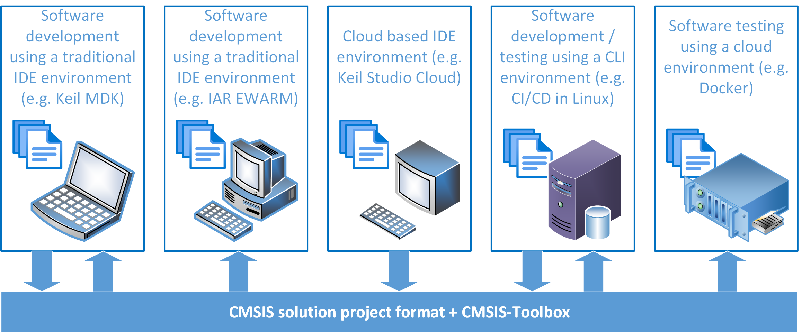
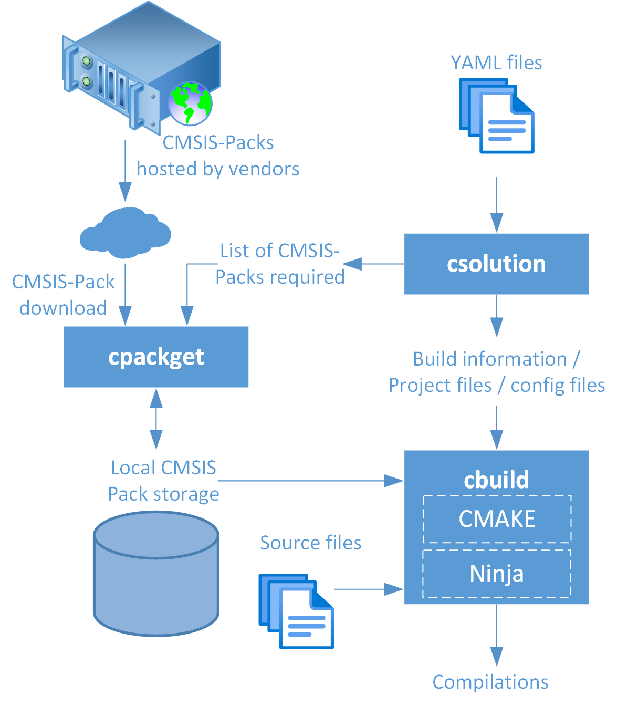
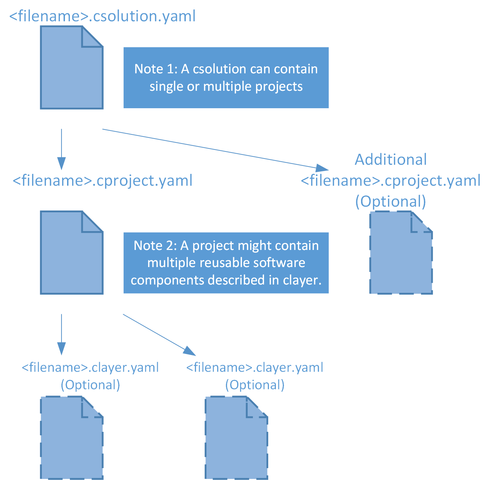
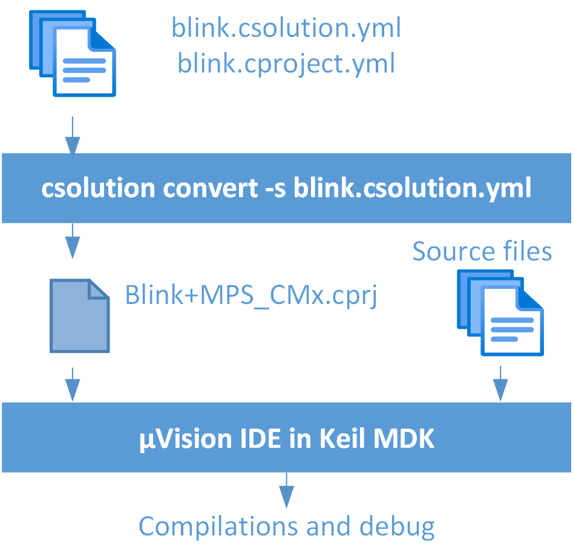
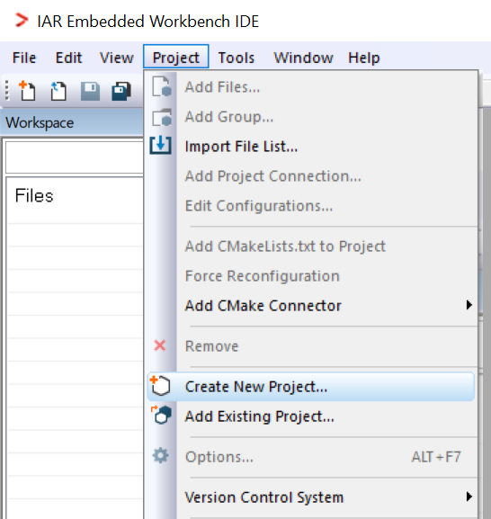
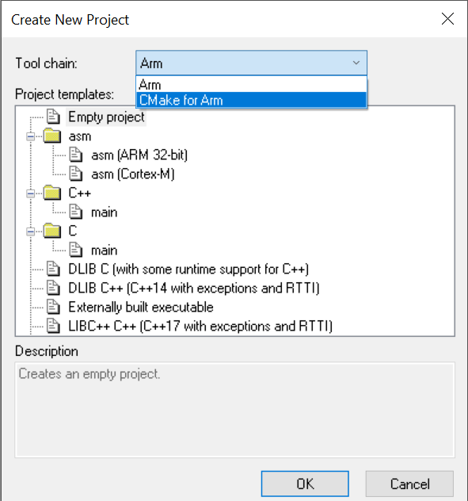
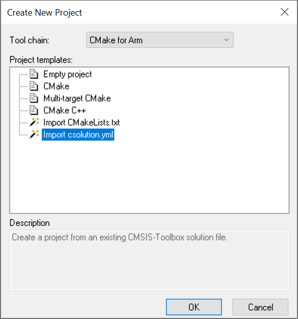
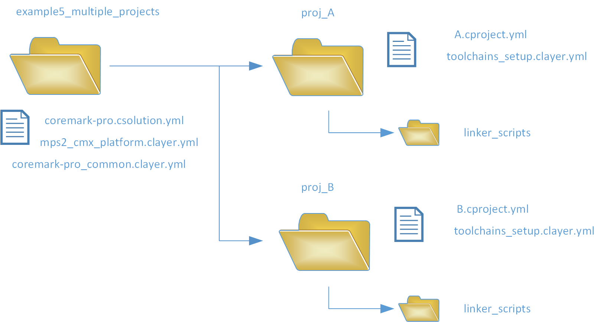

# Simplifying the integration of software components in modern microcontroller systems

An introduction to the CMSIS-Toolbox and CMSIS-Compiler

```
Joseph Yiu
Distinguished Engineer, IoT Line of Business, Arm
Cambridge, UK
```

## Abstract

The use of CMSIS-Pack to deliver software components for modern microcontroller projects has been ongoing for many years. For example, software packages for device support, communication stacks, and crypto libraries are often available as CMSIS-Packs. Several toolchain IDEs already have CMSIS-Pack support built in, making it easier for software developers to create projects using these software packs. However, many software developers use development workflows without an IDE, for example, for regression environments for CI/CD. The CMSIS-Toolbox (an open-source project) is designed to provide a range of tools to make project workflow with CMSIS-Packs easier.

CMSIS-Toolbox provides several utilities to enable the automation of the downloading of CMSIS-Packs, generating project files, and compilation. It supports multiple compilers and works with build systems like CMAKE. In addition, the CMSIS-Toolbox can be integrated as a part of a toolchain.

In this paper, I provide an overview of the CMSIS-Toolbox and explain how to use it to create a portable project setup that can work with multiple toolchains. The project can be easily ported to different hardware platforms.

Keywords: Software components; compilation; development toolchain; YAML files; csolution; cproject; clayer

## BACKGROUND

The complexity of software running in high-end microcontrollers has increased significantly over the last decade. For example, in addition to Real-Time Operating Systems (RTOS) and communication stacks, both of which have been widely used for many years, additional layers of software communication protocols (e.g. MQTT) and advanced security management (e.g. cloud-based device management) are now required in modern IoT applications. At the same time, the use of middleware such as GUI libraries, DSP libraries and machine learning software frameworks has also added to the complexity of software integration. As a result, it is often ineffective to manually integrate all those software components.

To help manage multiple software components in embedded system projects, Arm® introduced the CMSIS-PACK in 2014 as part of CMSIS version 4 (CMSIS – it was originally named Cortex® Microcontroller Software Interface Standard and was renamed Common Microcontroller Software Interface Standard in 2023). A software component delivered as a CMSIS-PACK package contains software files, optional documentation, as well as an XML-based package description file. This XML file enables development tools to understand the contents, as well as the dependency of the package. The CMSIS-PACK mechanism has now become the most popular standard for distributing MCU device specific software packages. Today, for example, there are around 1400 CMSIS-PACKs available, supporting over 10000 Arm based microcontrollers/devices.

While the use of the CMSIS-PACK mechanism in toolchains with an IDE has been popular and successful, the landscape of how software is developed has changed. As well as using traditional IDEs, many software developers now also need to work with regression test environments (sometimes referred as Continuous Integration and Continuous Deployment, or "CI/CD") and test environments for ML (Machine Learning) model tuning (sometimes referred as MLOps). These test environments are usually based on Command Line Interface (CLI), which can run in local or on remote servers (e.g. cloud servers, including systems like GitHub actions). To facilitate the use of CMSIS-PACK in these situations, additional workflow solutions are needed.

Apart from the challenge of integrating CMSIS-PACK components in CLI environments, there are now additional software development challenges. These are:

* For many middleware vendors, their regression-test environments need to support multiple toolchains (e.g. Arm Compiler, gcc, LLVM, IAR™, etc.) and multiple devices (potentially with multiple types of Arm Cortex-M processors). This is because their customers could be using different tools and devices.
* Due to the requirements of CI/CD and MLOps software workflows, the software integration solutions need to support different compute platforms (e.g. Windows, Linux, MacOS for both x86 and Arm64 hardware).
* The software integration solution also needs to work with cloud automation systems such as GitHub Actions.

Because of the new workflow requirements, Arm started the CMSIS-Build project. This project has subsequently evolved into the CMSIS-Toolbox project, which is a superset of the original CMSIS-Build. CMSIS-Toolbox is designed to:

* Enable the use of CMSIS-PACKs in CLI workflow environments, which is common for CI/CD and MLOps.
* Allow software projects to be used with multiple toolchains with different OS environments.



The CMSIS-Toolbox project is now version 2.2.1 (22-March-2024) and is gaining traction in the embedded software ecosystem. In addition to the CMSIS-Toolbox project, CMSIS contains many other projects that are also widely used in the embedded software industry. For an overview of CMSIS, please refer to the following [article](https://community.arm.com/arm-community-blogs/b/tools-software-ides-blog/posts/what-are-cmsis-software-components).

## GENERAL INFORMATION ABOUT THE CMSIS-TOOLBOX

The CMSIS-Toolbox is not just about the utilities, it is also about standardizing the utilization of YAML files to describe projects and the software components that are required. The YAML based projects are called "csolution" projects. With such open standardization, any tool vendor in the Arm ecosystem is able to deliver support for YAML based project configuration files. This also means that software developers can use the same project configurations for multiple toolchains.

The CMSIS-Toolbox utilities are opensource projects and are part of the Open-CMSIS-Pack (https://www.open-cmsis-pack.org/). The links to the source code repositories can be found in the [Open-CMSIS-Pack GitHub](https://github.com/Open-CMSIS-Pack). To download the pre-built binary packages, please visit the [release page](https://github.com/Open-CMSIS-Pack/cmsis-toolbox/releases).

The CMSIS-Toolbox binary releases can be used as a set of standalone utilities in CLI environments. This is very useful in regression tests and in CI/CD environments. CMSIS-Toolbox executables are now available for the following operating systems:

* Windows (x86 and Arm64)
* Linux (x86 and Arm64)
* MacOS (x86 and Arm64)

Currently, the CMSIS-Toolbox can be used with the following toolchains:

* Arm Compiler 6
* IAR Compiler for Arm
* GCC (GNU Compiler Collection)
* LLVM Embedded

In addition, the following IDEs are compatible with the CMSIS-Toolbox:

* Keil™ Microcontroller Development Kit 6 (MDK 6) from Arm. This includes: Keil Studio IDE (based on Visual Studio Code) and µVision IDE.
* IAR™ Embedded Workbench for Arm (EWARM)

In some cases, the executables from the CMSIS-Toolbox execute behind the scene of the development environment (e.g. Keil Studio IDE). Alternatively, it is also possible for 3rd party tool vendors to provide native support.

Some of the IDEs allow legacy projects (based on a proprietary project format) to be exported to the YAML format so that they can be used with the CMSIS-Toolbox. For example, in Keil µVision IDE, you can export a project via the pulldown menu as follows: Project -> Export -> Save Project to csolution format

The CMSIS-Toolbox is highly versatile and powerful, but at the same time, can be a bit overwhelming for beginners. Fortunately, there are a range of resources available and these are as follows:

|Resources|URL|
|---|---|
|Open CMSIS-Pack home page|https://www.open-cmsis-pack.org/|
|CMSIS-ToolBox git repository|https://github.com/Open-CMSIS-Pack/cmsis-toolbox|
|CMSIS-ToolBox documentation|https://open-cmsis-pack.github.io/cmsis-toolbox/|
|CMSIS-ToolBox documentation – installation guide|https://open-cmsis-pack.github.io/cmsis-toolbox/installation/|
|CMSIS-Toolbox examples|https://github.com/Open-CMSIS-Pack/csolution-examples|
|Browsing available CMSIS-PACKs|https://www.keil.arm.com/packs/|
|Open-CMSIS-Pack git repository|https://github.com/Open-CMSIS-Pack|
|Examples in this paper|https://github.com/Arm-Examples/EW2024_CMSIS-Toolbox|

For middleware vendors, additional resources for creating CMSIS-PACKs are also available.

|Resources|URL|
|---|---|
|Git repository for pack tools (e.g. packchk, svdconv)|https://github.com/Open-CMSIS-Pack/devtools/tree/main/tools|
|Pack Tutorial|https://open-cmsis-pack.github.io/Open-CMSIS-Pack-Spec/main/html/cp_PackTutorial.html |

Binary executables of the CMSIS-PACK tools (e.g. packchk, svdconv) are available as part of the CMSIS-Toolbox bundle.

## AN ANATOMY OF THE CMSIS-TOOLBOX

The key components of the CMSIS-Toolbox include three utilities:

• cpackget: Pack manager – This utility allows you to install and manage software packs in the development environment.
• csolution: Project manager – This utility allows you to create build information for the applications, which might contain one or multiple projects. This tool also helps you to analyze the details of the project.
• cbuild: Build Invocation – This utility orchestrates the build steps (based on the CMAKE compilation process).



Users can directly use these utilities via CLI. If you are using Keil Studio IDE, these CMSIS-Toolbox utilities are used behind the scene. It is also possible for a toolchain to directly support csolution project files so that users can use the same YAML files to setup their projects.
The YAML files include three types of file:

* csolution (*.csolution.yaml/.yml) – CMSIS solution: a solution is a container used to organize related projects that are part of a larger application.
* cproject (*.cproject.yaml/.yml) – CMSIS project: an individual project. The yaml file defines the contents of the independent build.
* clayer (*.clayer.yaml/.yml) – CMSIS software layer. The yaml file defines reusable code with a preconfiged set of software files and software components. A cproject can pull in clayer YAML file(s) to utilize the reusable codes.

The hierarchy of these YAML files is illustrated by the following figure:



In a basic project, you can have just a csolution and a cproject YAML files, and no clayer file.
There are many advantages of using YAML files when compared to using project files in binary formats. For example, you can easily edit the project files with a text editor. And text files work well with various repository technologies (e.g. Git, Subversions, etc).
It is important to highlight that the CMSIS-Toolbox does not replace existing build utilities like CMAKE. In fact, the cbuild utility uses CMAKE (https://cmake.org/) and Ninja-build (https://ninja-build.org/) underneath to handle the compilation process. You can view csolution and cbuild as an additional layer on top. This arrangement provides the following benefits:

* CMSIS-Toolbox makes integration of CMSIS-PACKs much easier.
* Software developers do not have to learn the details of CMAKE as the CMAKE configurations and the compilation process are handled by the cbuild utility.
* The default configurations for using various toolchains with CMAKE are already provided by CMSIS-Toolbox, saving a deal of time for software developers.
* CMAKE and Ninja build are already highly optimized for various OS platforms, with the CMSIS-Toolbox leveraging the benefits of using these tools.

## INSTALLATION

The installation guide of the CMSIS-Toolbox is available in this page:
https://open-cmsis-pack.github.io/cmsis-toolbox/installation/

The key steps to creating a working tool environment includes:

* Setting up a compilation toolchain(s) (if not already installed).
* Installing the CMSIS-Toolbox utilities.
* Setting up a location that stores CMSIS-Packs locally. 
* Setting up environment variables and search paths.

If you are using the CMSIS-Toolbox utilities directly, you also need to install the following tools:

* CMAKE
  * If you are using a modern Linux distribution, you can install CMAKE using "sudo apt install cmake". Otherwise, for other installers, please visit https://cmake.org/download  .
* Ninja (build system)
  * If you are using a modern Linux distribution, you can install Ninja using "sudo apt install ninja-build". Otherwise, for other installers, please visit https://ninja-build.org.

If you would like to try out the Arm Compiler 6 (AC6) with the CMSIS-Toolbox, you can use the AC6 with a community license. Further information is available here: https://learn.arm.com/learning-paths/microcontrollers/vcpkg-tool-installation/licenseactivation/ 

If you are using a cloud computing environment such as Docker, instead of installing the tools manually, you could use the VCPGK mechanism to install the tool from an artifactory system. Information for this installation method is covered here: https://open-cmsis-pack.github.io/cmsis-toolbox/installation#vcpkg-setup-using-cli  

You can also use VCPKG with Visual Studio Code. Information for this can be found here: https://open-cmsis-pack.github.io/cmsis-toolbox/installation#vcpkg-setup-in-vs-code 

Please note that currently the VCPKG method is not supported on Arm64 Linux systems.

## EXAMPLE 1 – A BASIC EXAMPLE OF USING THE CMSIS-TOOLBOX

To demonstrate the usage of the CMSIS-Toolbox, a minimalistic application that toggles an LED is created. This example is based on a Cortex-M4 system running the Arm MPS2/MPS2+ FPGA prototyping system. This platform was selected because of the simple device driver setup when compared to most commercial microcontroller devices.

The example contains:

1)	A C program (https://github.com/Arm-Examples/EW2024_CMSIS-Toolbox/blob/main/example1_cm4_mps2_an386/blink.c)
2)	A csolution YAML file (https://github.com/Arm-Examples/EW2024_CMSIS-Toolbox/blob/main/example1_cm4_mps2_an386/blink.csolution.yml)
3)	A cproject YAML file (https://github.com/Arm-Examples/EW2024_CMSIS-Toolbox/blob/main/example1_cm4_mps2_an386/blink.cproject.yml)

The [application code](https://github.com/Arm-Examples/EW2024_CMSIS-Toolbox/blob/main/example1_cm4_mps2_an386/blink.c) is as follows:

```
#ifdef CMSDK_CM4_FP
#include "CMSDK_CM4_FP.h"
#include "Board_LED.h"  /* Requires LED component and Keil Middleware Pack*/
#endif

void led_init(void);
void led_set(int val);
void SysTick_Handler(void);

int main(void)
{
  uint32_t ret_status;
  led_init();
  ret_status = SysTick_Config(SystemCoreClock/10);
  if (ret_status != 0) { /* 0=success, 1=error */
    while(1);
    }
  while(1) {
    __WFI();
    }
}

/*-------------------------*/
void led_init(void)
{
#ifdef CMSDK_CM4_FP
  LED_Initialize();
#endif
  return;
}
/*-------------------------*/
void led_set(int val)
{
#ifdef CMSDK_CM4_FP
  LED_SetOut(val);
#endif
  return;
}
/*-------------------------*/
/* Execute at 10Hz */
void SysTick_Handler(void)
{
  static int curr_state=0; /* Current state 0 or 1 */
  
  curr_state ^=  1L;   /* Toggle */
  led_set(curr_state); /* Output */
  return;
}

```

After the processor boots up, the code configures the SysTick timer to generate interrupts at 10Hz, and toggles the LED each time the SysTick_Handler() is executed.

The [csolution file](https://github.com/Arm-Examples/EW2024_CMSIS-Toolbox/blob/main/example1_cm4_mps2_an386/blink.csolution.yml) is as follows. It selects the device, adds optional preprocessing macros and defines the cproject file.

```
solution:
  created-for: CMSIS-Toolbox@2.0.0
  description: Blinky
  cdefault:
  # Default compiler - can be AC6,CLANG,GCC,IAR. 
  # This can be overridden using command line option.
  compiler: CLANG

  target-types:
    - type: MPS2_CM4
      device: CMSDK_CM4_FP #or ARM::CMSDK_CM4_FP
      misc:
        - C:
          - -DCMSDK_CM4_FP
        - CPP:
          - -DCMSDK_CM4_FP

  output-dirs:             # This is optional
    outdir: ./out/$TargetType$/

  projects:
    - project: ./blink.cproject.yml

```
The [cproject file](https://github.com/Arm-Examples/EW2024_CMSIS-Toolbox/blob/main/example1_cm4_mps2_an386/blink.cproject.yml ) describes the CMSIS-PACKs required (optionally specifies the version of the packs), the files in the project and the software components in the CMSIS-PACKs to be used.
```

project:

# it is recommended to list the packs that contain the components in the cproject.yml file.
  packs:
    - pack: ARM::CMSIS                     # Note:version specifier is optional
    - pack: Keil::V2M-MPS2_CMx_BSP@1.8.1   # Note:version specifier is optional
    - pack: Keil::MDK-Middleware           # Need by the LED component
    - pack: Keil::MDK-Middleware_Graphics  # Need by the MDK-Middleware pack

  groups:
    - group: Documentation
      files: 
        - file: ./README.md
    - group: App
      files:
        - file: ./blink.c

  components:
    - component: ARM::CMSIS:CORE    # CMSIS
    - component: Keil::Device:Startup&C Startup    # Device startup
    - component: Keil::Board Support&V2M-MPS2:LED  # LED component

```
The device startup code and low-level drivers are inside the CMSIS-PACK for the hardware platform (Keil::V2M-MPS2_CMx_BSP) and the Keil MDK-Middleware. In this project:

* Linker scripts for the toolchain are automatically generated by the CMSIS-Toolbox from the memory layout specified by the CMSIS-PACK’s description file (.pdsc).
* The compiler and linker options are taken from the default options in the CMSIS-Toolbox template files.

## COMPILING EXAMPLE 1 IN A COMMAND LINE INTERFACE ENVIRONMENT (CLI)

If you are using a CLI environment, you can build the project using the following steps:

Step 1 (optional) – update the local copy of the pack index. This is recommended if you have not recently updated the pack index of your local CMSIS-Packs storage.

```
$> cpackget update-index
```

Step 2 – Generate a list of CMSIS-Packs that are not available in your local CMSIS-Pack storage from the csolution and cproject files.

```
$> csolution list packs -s blink.csolution.yml -m > required_packs.txt
```

Step 3 – Install the missing CMSIS-Pack(s) using the list generated in step 2.

```
$> cpackget add -f required_packs.txt
```

Step 4 - Generate build information.

```
$> csolution convert blink.csolution.yml
```

Sometimes you need to update header files in the Run-Time Environment by adding the update-rte option:

```
$> csolution convert blink.csolution.yml update-rte
```

Optionally, you can specify a toolchain instead of using the default toolchain listed in the csolution file:

```
$> csolution convert blink.csolution.yml update-rte --toolchain {AC6/GCC/CLANG/IAR}
```

Step 5 – Run the compilation flow (Note: MPS2_CM4 below is the context identifier/type in the csolution file)

```
$> cbuild blink+MPS2_CM4.cprj
```

Optionally, you can specify a toolchain instead of using the default toolchain listed in the csolution file:

```
$> cbuild blink+MPS2_CM4.cprj --toolchain  {AC6/GCC/CLANG/IAR}
```

Step 2 to step 5 can be combined into a single step:

```
$> cbuild blink.csolution.yml --packs --update-rte --toolchain  {AC6/GCC/CLANG/IAR}
```

To make it easier going through the steps, a makefile (for Linux) and a batch file (for Windows) is prepared in the Github repository.

## COMPILING THE PROJECT WITH THE µVISION IDE IN KEIL MDK

In the Keil Microcontroller Development Kit 6 (MDK6), there are two IDEs available:

* Keil Studio IDE natively supports csolution project files.
* Keil µVision IDE - Starting from version 5.40, the IDE directly supports csolution project files.

If you are using an older version of µVision IDE in Keil MDK, the IDE can read the .cprj files generated from csolution.  In a Windows system with Keil µVision IDE installed, the .cprj file extension is normally associated with the µVision IDE, so you can open the project just by double clicking the .cprj file generated by the csolution utility. The workflow is illustrated by the following diagram:



After opening the project in µVision IDE, the project can be compiled and debugged in the same way that a traditional µVision project is. In general, you can compile and debug a csolution project with recent versions of Keil MDK, no matter which IDE you are using.

## COMPILING THE PROJECT WITH THE IAR EMBEDDED WORKBENCH FOR ARM (EWARM)

Starting from IAR EWARM version 9.50, a csolution file can be imported when creating a new project. To use this feature, you need:

* the CMSIS-Toolbox, CMAKE and Ninja-Build installed, and 
* a local CMSIS-Pack storage location, and 
* environment variables setup according to the [CMSIS-Toolbox installation guide](https://open-cmsis-pack.github.io/cmsis-toolbox/installation/).

After the required tool setups have been undertaken, the csolution file can be imported using the following steps:

* Step 1 – edit the csolution file to set the default toolchain to IAR
* Step 2 – in the EWARM IDE’s pulldown menu, select Project->Create New Project.



* Step 3 – Select CMake for Arm



*- Step 4 – Select Import csolution.yml



* Step 5 – Select blink.csolution.yml in the File dialog box
* Step 6 – Enter a name for the IAR project that will be created (e.g. blink.ewp). It takes a few moments for EWARM to import the project.
* Step 7 – Review the project settings and adjust as needed. 
* Step 8 – Before compilation, save the project workspace.

After these steps, the csolution project can be then be compiled and debugged as in conventional IAR projects.

Additional information about using EWARM with CMSIS-Toolbox projects can be found in the IAR Embedded Workbench document – IDE Project Management and Building Guide (version 9.50 or newer).

## RUN TIME ENVIRONMENT (RTE) FOLDER

After running the csolution utility to generate the build information, you might notice that a new directory has been generated called RTE (Run Time Environment). This directory is used to store a number of files that are either generated or have been copied from the CMSIS-PACKs. Examples of those files are:

* Startup codes, system initialization codes and other device driver related files that may be customized by software developers.
* Linker scripts.
* Configuration header files (e.g. "RTE_Components.h").

When running csolution to generate build information, you have the option to regenerate the files in the RTE folder (using the "update-rte" parameter option). When this option is used, the existing RTE files that have been customized are overwritten. Thus, if there are any modifications that need to be kept, you need to make sure that the modified files are copied to another location.

## FURTHER INFORMATION REGARDING CREATING PROJECTS

When creating a project with the CMSIS-Toolbox, one of the challenges for beginners is determining the correct names for:

* the device.
* the components within the CMSIS-Packs.

If Keil MDK is installed, one easy way to obtain the right YAML codes (that contains the device and component names) is to create a project in µVision IDE and then export the project into the csolution format. Alternatively, you can list the device/components/installed packs using the csolution utility in a CLI:

```
$> csolution list devices 	# List the supported devices in the installed CMSIS-PACKs
$> csolution list components 	# List the software components in the installed CMSIS-PACKs
$> csolution list packs 	# List the installed CMSIS-PACKs
```

Information about the command line options of csolution, cbuild and cpackget can be found in [this page](
https://open-cmsis-pack.github.io/cmsis-toolbox/build-tools/).

## EXAMPLE 2 - A HELLO WORLD PROJECT USING THE CMSIS-TOOLBOX AND CMSIS-COMPILER

When working with multiple toolchains, one of the common challenges is how to deal with compiler specific operations such as printf retargeting and file I/O operations. To overcome this, Arm has created the CMSIS-Compiler project which provides a common abstraction layer for those operations. Although the CMSIS-Compiler and the CMSIS-Toolbox are two separate projects, they are often used together.

The CMSIS-Compiler is available as a CMSIS-Pack and is integrated into a project in the same way that other CMSIS-Packs are. The CMSIS-Compiler supports multiple features, with the ability to enable/disable each feature by including the corresponding software components in the CMSIS-Pack in the cproject YAML file. The follow table lists the software components in the CMSIS-Compiler pack.

|Component|Description|
|---|---|
|ARM::CMSIS-Compiler:CORE|Always required when using CMSIS-Compiler|
|ARM::CMSIS-Compiler:STDOUT:Breakpoint|STDOUT using semihosting|
|ARM::CMSIS-Compiler:STDOUT:Custom|STDOUT using custom define interface (e.g. UART)|
|ARM::CMSIS-Compiler:STDOUT:Event Recorder|STDOUT using Event Recorder / CMSIS-View|
|ARM::CMSIS-Compiler:STDOUT:ITM|STDOUT with ITM (Instrumentation Trace Macrocell) via trace interface|
|ARM::CMSIS-Compiler:STDIN:Breakpoint|STDIN using semihosting|
|ARM::CMSIS-Compiler:STDIN:Custom|STDIN using custom define interface (e.g. UART)|
|ARM::CMSIS-Compiler:STDIN:ITM|STDIN using a simple communication buffer|
|ARM::CMSIS-Compiler:File Interface:Breakpoint|File I/O via semihosting|
|ARM::CMSIS-Compiler:File Interface:Custom|Custom File I/O|
|ARM::CMSIS-Compiler:TTY:Breakpoint|TTY using semihosting|
|ARM::CMSIS-Compiler:TTY:Custom|TTY using custom define interface |
|ARM::CMSIS-Compiler:TTY:ITM|TTY with ITM via trace interface|
|ARM::CMSIS-Compiler:STDERR:Breakpoint|STDERR using semihosting|
|ARM::CMSIS-Compiler: STDERR:Custom|STDERR using custom define interface|
|ARM::CMSIS-Compiler: STDERR:Event Recorder|STDERR using Event Recorder / CMSIS-View|
|ARM::CMSIS-Compiler: STDERR:ITM|STDERR with ITM via trace interface|
|ARM::CMSIS-Compiler:File Interface:Breakpoint|File I/O via semihosting|
|ARM::CMSIS-Compiler:File Interface:Custom|File I/O via custom defined method|
|ARM::CMSIS-Compiler:File Interface:Custom|File I/O via custom defined method|
|ARM::CMSIS-Compiler:OS Interface|OS interface using CMSIS-RTOS2 API|
|ARM::CMSIS-Compiler:OS Interface:Custom|OS interface using custom defined API|

To enable printf support through a UART with the CMSIS-Compiler, the following components should be included in the project:

* ARM::CMSIS-Compiler:CORE
* ARM::CMSIS-Compiler:STDOUT:Custom

The application code that uses the printf support needs to provide the following APIs that interface with the STDOUT functionalities in CMSIS-Compiler:

Functions|Description|
|---|---|
|int stdio_init (void)|For initialization (e.g. Initialization of an UART). This function needs to be called at the beginning of the application before the execution of any printf/stdout functions.|
|int stdout_putchar (int ch)|For outputting a single character|

With this printf feature enabled, the CMSIS-Toolbox generates a header file `RTE_Components.h` which contains the following preprocessing C macros:

* RTE_CMSIS_Compiler_STDOUT
* RTE_CMSIS_Compiler_STDOUT_Custom

These macros allow you to conditionally include the wrapper code, which interfaces between the CMSIS-Compiler APIs and the UART control code.

For example, a simple implementation (a wrapper for low level UART functions) could be as follows:
(Program code snippets of https://github.com/Arm-Examples/EW2024_CMSIS-Toolbox/blob/main/example2_cm4_mps2_an386/uart_funcs.c)

```
…
int stdio_init (void) {
  UART_Config();
  return (0);	
}
…
#ifdef RTE_CMSIS_Compiler_STDOUT_Custom
int stdout_putchar (int ch) 
{
  return (UART_SendChar((uint32_t)ch));
}
#endif
…
```

Remember to include the function call to stdio_init() when creating the hardware initialization code.  With this wrapper code in place, the printf messages generated in the software are redirected to the UART interface.

The source code of the CMSIS-Compiler can be found at this GitHub location: https://github.com/ARM-software/CMSIS-Compiler, and the documentation can be found at https://arm-software.github.io/CMSIS-Compiler/latest/index.html.

## EXAMPLE 3 – LINKER SCRIPT AND OPTIONS FOR THE COMPILATION AND LINKAGE

If you have been using compilation toolchain(s) for a while, you will be aware that the compilation flow requires a linking stage to:

* combine the generated object files, and
* generate the executables.  

You no doubt noticed that I did not prepare a linker script that specified the memory layout in examples 1 and 2. In some cases, the CMSIS-PACK for the device you use could include default linker scripts for the toolchain that you are using. In that case the csolution utility can pick up the default linker script for the linking stage.

If the CMSIS-PACK does not provide a default linker script for the toolchain you have selected, the csolution automatically generates a linker script from a template using the memory layout extracted from the memory layout descriptions in the device’s CMSIS-PACK (i.e. the .pdsc file).  The following link contains further information: https://open-cmsis-pack.github.io/cmsis-toolbox/build-overview#automatic-linker-script-generation  

Instead of using the default linker script or the generated linker script, you can specify a custom linker script for the project. This may be necessary, if, for example:

* You need to specify the size of the stack and heap memory space, or
* The startup code / vector table code contains section names or symbols that do not match the section names used by the default linker script, or 
* Your project requires a custom memory layout. For example, when you need to place certain code sections in Tightly Coupled Memories (TCMs).
* 
In example 3 of this paper, the project is based on the CoreMark® benchmark from SPEC® Embedded Group (https://www.spec.org/eg/, formerly EEMBC®). CoreMark is a very popular benchmark for microcontroller devices. In this project (https://github.com/Arm-Examples/EW2024_CMSIS-Toolbox/tree/main/example3_cm4_mps2_an386), a number of linker scripts are prepared in the following directory : https://github.com/Arm-Examples/EW2024_CMSIS-Toolbox/tree/main/example3_cm4_mps2_an386/linker_scripts. These linker scripts define the stack and heap sizes which are different from the sizes specified in the default linker scripts. To allow the CMSIS-Toolbox to utilize these linker scripts, the cproject file contains the following text:

```
  linker:
    - script: linker_scripts/ac6_arm.sct
      for-compiler: AC6

    - script: linker_scripts/clang_linker_script.ld
      for-compiler: CLANG

    - script: linker_scripts/gcc_arm.ld
      for-compiler: GCC

    - script: linker_scripts/iar_linker_script.icf
      for-compiler: IAR

    - regions: linker_scripts/regions_CMSDK_CM4_FP.h
      for-compiler: CLANG
```

An easy way to prepare the linker script is to modify one using the default ones. For example, you can run csolution without specifying the linker script so that csolution will place/generate the default linker script in the RTE directory. After that, you can copy the linker scripts in the RTE directory to a different location (so that they will not get overwritten), customize them and then add the linker scripts’ location in the cproject file.
In addition to the linker script options, example 3 also includes:

a) Preprocessing macros for the CoreMark project

```
      define:
        - ITERATIONS: "2000"
        - STANDALONE
        - PERFORMANCE_RUN: "1"
```

b) Compilation and linker options for each toolchain

```
      misc:
        - for-compiler: AC6
          C:
            - -std=c99
            - -Omax
          C-CPP:
            - -Omax
            - -fno-rtti
            - -funsigned-char
            - -fshort-enums
            - -fshort-wchar
            - -ffast-math
            - -ffunction-sections
            - -Weverything
            - -Wno-packed
            - -Wno-reserved-id-macro
            - -Wno-unused-macros
            - -Wno-documentation-unknown-command
            - -Wno-documentation
            - -Wno-license-management
            - -Wno-parentheses-equality
          CPP:
            - -xc++
            - -std=c++98
          ASM:
            - -masm=auto
          Link:
            - --map
            - --load_addr_map_info
            - --xref
            - --callgraph
            - --symbols
            - --info sizes
            - --info totals
            - --info unused
            - --info veneers
            - --lto
            - -Omax
            - --strict
            - --summary_stderr
            - --info summarysizes
        - for-compiler: GCC
          C:
            - -Ofast
            - -ffast-math
            - -std=gnu11
          Link:
            - -Wl,-Map=$elf()$.map
        - for-compiler: CLANG
          C:
            - -std=gnu11
            - -Ofast
            - -ffast-math
          Link:
            - -Wl,-Map=$elf()$.map
        - for-compiler: IAR
          C-CPP:
            - -Ohs
            - --no_size_constraints
            - --dlib_config DLib_Config_Full.h
          Link:
            - --semihosting
            - --map=$elf()$.map

```

The options can be customized based on the needs of the project.

Instead of defining project compilation options in `.cproject.yml` files, it is possible to create a default configuration using a `cdefault.yml` file. If there is no `cdefault.yml` file in the project directory, the default compilation settings are taken from the `cdefault.yml` file at the CMSIS-Toolbox installation location (i.e. `<CMSIS_COMPILER_ROOT>/cdefault.yml`). But, if there is a `cdefault.yml` in the same directory as the `.csolution.yml` file, the settings in that file would be used instead. Additional information can be found at : https://open-cmsis-pack.github.io/cmsis-toolbox/YML-Input-Format#cdefault

## EXAMPLE 4 – SUPPORTING MULTIPLE HARDWARE TARGETS

Middleware developers often need to test their software on multiple hardware platforms. The csolution project format supports this need by allowing multiple contexts. In the csolution project file for example 4 (https://github.com/Arm-Examples/EW2024_CMSIS-Toolbox/blob/main/example4_mps2_multi_devices/coremark.csolution.yml), the following code defines the contexts:

```
  target-types:
    - type: MPS2_CM0
      device: CMSDK_CM0
      optimize: speed
      misc:
        - C:
          - -DCMSDK_CM0
        - CPP:
          - -DCMSDK_CM0
    - type: MPS2_CM0plus
      device: CMSDK_CM0plus
      optimize: speed
      misc:
        - C:
          - -DCMSDK_CM0plus
        - CPP:
          - -DCMSDK_CM0plus
...

    - type: MPS2_CM33
      device: IOTKit_CM33
      optimize: speed
      misc:
        - C:
          - -DIOTKit_CM33
        - CPP:
          - -DIOTKit_CM33
    - type: MPS2_CM33_FP
      device: IOTKit_CM33_FP
      optimize: speed
      misc:
        - C:
          - -DIOTKit_CM33_FP
        - CPP:
          - -DIOTKit_CM33_FP

```

The names MPS2_CM0, MPS2_CM0plus, etc, are context identifiers which are used in csolution files to allow filtering or to selectively apply settings. Each context has its own device type. Additionally, a preprocessing macro is added for each context so that the application codes can be easily adjusted using preprocessing in the compilation flow.

Because different devices require different packs, multiple device packs have been included in the [cproject file](https://github.com/Arm-Examples/EW2024_CMSIS-Toolbox/blob/main/example4_mps2_multi_devices/coremark.cproject.yml):

```
project:
  packs:
    - pack: ARM::CMSIS                      
    - pack: Keil::V2M-MPS2_CMx_BSP          
    - pack: Keil::V2M-MPS2_IOTKit_BSP@1.5.1 
    - pack: Keil::MDK-Middleware # LED
    - pack: Keil::MDK-Middleware_Graphics
    - pack: ARM::CMSIS-Compiler # for printf
...
```

Additionally, the selection of software components in these packs are based on the context identifiers in the csolution as follows:

```
  components:
    - component: ARM::CMSIS:CORE
    - component: Keil::Device:Startup&C Startup
    - component: ARM::CMSIS-Compiler:CORE
    - component: ARM::CMSIS-Compiler:STDOUT:Custom
    - component: Keil::Board Support&V2M-MPS2:LED
      for-context:
        - +MPS2_CM0
        - +MPS2_CM0plus
        - +MPS2_CM3
        - +MPS2_CM4
        - +MPS2_CM4_FP
        - +MPS2_CM7
        - +MPS2_CM7_SP
        - +MPS2_CM7_DP
    - component: Keil::Board Support&V2M-MPS2 IOT-Kit:LED  # LED component
      for-context:
        - +MPS2_CM33
        - +MPS2_CM33_FP
        - +MPS2_CM23

```

When the csolution utility is run to generate build information, the tool generates build information for all available contexts. This means that there are multiple .cprj files and .cbuild.yml files. The project with the required context can then be compiled by selecting the corresponding output file.

Alternatively, build information for only one context can be generated by adding `--context` in the command line. For example, if we only need to generate the build information for the MPS2_CM3 (Cortex-M3) context, the command line is:

```
$> csolution convert coremark.csolution.yml --context +MPS2_CM3
```

Context filtering can be used to conditionally select program source files. For example, if we want to support two hardware platforms, `MCU_A` and `MCU_B`, we can define two contexts and selectively pull in program code, as follows:

```
  groups:
    - group: MCU_A_Driver
      for-context: 
        - +MCU_A
      files:
        - file: mcu_a_file1.c
        - file: mcu_a_file2.c
        
    - group: MCU_A_Driver
      for- context:
        - +MCU_B
      files:
        - file: mcu_b_file1.c
        - file: mcu_b_file2.c

```

Similarly, you can select linker scripts based on context as well as toolchain, as follows:

```
  linker:
    - script: linker_scripts/ac6_arm_mcu_a.sct
      for-context: 
        - +MCU_A
      for-compiler: AC6

    - script: linker_scripts/ac6_arm_mcu_b.sct
      for-context: 
        - +MCU_B
      for-compiler: AC6

    - script: linker_scripts/clang_linker_script_a.ld
      for-context: 
        - +MCU_A
      for-compiler: CLANG

    - script: linker_scripts/clang_linker_script_b.ld
      for-context: 
        - +MCU_B
      for-compiler: CLANG

    - script: linker_scripts/gcc_arm_a.ld
      for-context: 
        - +MCU_A
      for-compiler: GCC

    - script: linker_scripts/gcc_arm_b.ld
      for-context: 
        - +MCU_B
      for-compiler: GCC

    - script: linker_scripts/iar_linker_script_a.icf
      for-context: 
        - +MCU_A
      for-compiler: IAR

    - script: linker_scripts/iar_linker_script_b.icf
      for-context: 
        - +MCU_B
      for-compiler: IAR

    - regions: linker_scripts/regions_mcu_a.h
      for-context: 
        - +MCU_A
      for-compiler: CLANG

    - regions: linker_scripts/regions_mcu_b.h
      for-context: 
        - +MCU_B
      for-compiler: CLANG

```

## EXAMPLE 5 – SUPPORTING MULTIPLE PROJECTS

In many instances, a CMSIS solution contains multiple projects. For example:

* You might have a suite of tests to run on a platform.
* An application consisting of multiple program images such as separate secure firmware and application codes.
 
In this example, I use the CoreMark-Pro from SPEC to illustrate how to create a CMSIS solution with multiple projects. CoreMark-Pro is a benchmark for high performance microcontrollers. It consists of 9 tests, with some of the tests taking up to 4MB of RAM space to execute. Because some of the tests use double precision floating-point operations, I have, for this example, used a Cortex-M7 system running on an Arm MPS2+ FPGA platform. The CoreMark-Pro setup is in the following location:

https://github.com/Arm-Examples/EW2024_CMSIS-Toolbox/tree/main/example5_multi_projects.

To create the setup, I have created one csolution file and multiple cproject files. In addition, I have used clayer files for common project definitions such as common files and C macros in CoreMark-Pro, as well as hardware platform support files. For each project, a separate subdirectory is used. This requirement is defined in the CMSIS-Toolbox documentation (https://open-cmsis-pack.github.io/cmsis-toolbox/build-overview#project-area). An illustration of the YAML file setup used in this example is illustrated by the following figure. Note: Software developers can choose their own filenames, folder names and the structure of the directories.



For each project, different linker scripts are created because the heap and stack size requirements and compiler options for each project can be different.

In the csolution file, the cproject files are defined in the projects section, as follows:

```
solution:
  created-for: CMSIS-Toolbox@2.0.0
  description: CoreMark-Pro
  
  cdefault:
  # Default compiler - can be AC6, CLANG, GCC, IAR. 
  # This can be overridden using command line option.
  compiler: AC6

  target-types:
    - type: MPS2_CM7_DP
      device: CMSDK_CM7_DP
      optimize: speed
      misc:
        - C:
          - -DCMSDK_CM7_DP
        - CPP:
          - -DCMSDK_CM7_DP

  projects:
    - project: proj_core/core.cproject.yml
    - project: proj_cjpeg-rose7-preset/cjpeg-rose7-preset.cproject.yml
    - project: proj_linear_alg-mid-100x100-sp/linear_alg-mid-100x100-sp.cproject.yml
    - project: proj_loops-all-mid-10k-sp/loops-all-mid-10k-sp.cproject.yml
    - project: proj_nnet_test/nnet_test.cproject.yml
    - project: proj_parser-125k/parser-125k.cproject.yml
    - project: proj_radix2-big-64k/radix2-big-64k.cproject.yml
    - project: proj_sha-test/sha-test.cproject.yml
    - project: proj_zip-test/zip-test.cproject.yml
```

Each of the cproject YAML file define the source files and C macros that are specific to that project. Source files and C macros that are common between projects are pulled in via a clayer YAML file. Additionally, the toolchains setups are defined using a local clayer YAML file (`toolchains_setup.clayer.yml`), which selects project specific linker scripts and compilation options.

[A cproject file for the "core" test in CoreMark-Pro](https://github.com/Arm-Examples/EW2024_CMSIS-Toolbox/blob/main/example5_multi_projects/proj_core/core.cproject.yml)

```
project:
  description: CoreMark-Pro core project files

  groups:
    - group: core
      files:
        - file: ../externals/coremark-pro/benchmarks/core/core_mith.c
        - file: ../externals/coremark-pro/benchmarks/core/core_list_join.c
        - file: ../externals/coremark-pro/benchmarks/core/core_matrix.c
        - file: ../externals/coremark-pro/benchmarks/core/core_state.c
        - file: ../externals/coremark-pro/benchmarks/core/core_util.c
        - file: ../externals/coremark-pro/benchmarks/core/core_portme.c
        - file: ../externals/coremark-pro/workloads/core/core.c

  add-path:
    - ../externals/coremark-pro/benchmarks/core

  define:
    - USE_FP32: 1
    - USE_FP64: 0

  layers:
    - layer: ../coremark-pro_common.clayer.yml
    - layer: ../mps2_cmx_platform.clayer.yml
    - layer: toolchains_setup.clayer.yml

```

The source files and C macros that are common to all Coremark-Pro tests are defined in the `coremark-pro_common.clayer.yml`.

With this arrangement, csolution generates multiple .cprj and .cbuild.yml files (one set per test). Individual program images can then be compiled using the cbuild command.

## DESIGN CONSIDERATIONS AND CHALLENGES

In this paper I have only covered a subset of the features which are present in the CMSIS-Toolbox and CMSIS-Compiler. There are many additional features that I have not covered. Please refer to CMSIS-Toolbox and CMSIS-Compiler documentation for additional information.

While the CMSIS-Toolbox and CMSIS solution project format have a number of benefits, there are also some limitations. For example:

* Some of the toolchain specific options (e.g. debug options) are not supported or are not portable across toolchains.
* There are toolchain specific behaviors which could lead to different results when the projects are compiled using different compilers.
* Currently the CMSIS-Toolbox supports 4 compiler/toolchains. There are tool chains that are not supported. The CMSIS team is open to support additional toolchains, but this will take time.

In addition, there are on-going challenges that need to be addressed. For example, some of the CMSIS-PACKs for older microcontroller devices are not, for various reasons, fully compatible with the CMSIS-Toolbox. For example:

* The startup codes of some of the devices could be written in assembly language. Ideally the startup code should be written in C so that it can work with multiple toolchains. Examples of C startup codes and system initialization code templates are available in the CMSIS 6 repository: https://github.com/ARM-software/CMSIS_6/tree/main/CMSIS/Core/Template/Device_M/Source
* Some of the existing CMSIS-PACKs for devices require custom linker scripts but they might not contain the required linker scripts for some of the toolchains. Although the CMSIS-Toolbox can generate linker scripts from templates, the generated linker scripts might not contain symbols that match the symbols used by the source code and, hence, further customization of the linker scripts would be needed.

Additional enhancements for the CMSIS-Toolbox are ongoing. Software developers should therefore periodically check the availability of new versions. You might also see enhancements in various toolchains which improve the available support of csolution projects.

## ADDITIONAL RESOURCES

The Open-CMSIS-Pack Git Repository contains examples of using the CMSIS-Toolbox: https://github.com/Open-CMSIS-Pack/csolution-examples. For example, the Hello world example (https://github.com/Open-CMSIS-Pack/csolution-examples/tree/main/Hello) demonstrated printf handling using the CMSIS-Compiler, that work using different toolchains.

In addition, the Arm Example Git Repository (https://github.com/Arm-Examples/) contains a range of examples that demonstrate various workflows in various environments.

## SUMMARY

In this paper, I have illustrated the csolution (CMSIS Solution) project format and the CMSIS-Toolbox. The csolution projects are based on YAML syntax. The CMSIS-Toolbox is a set of utilities for

* handling csolution files, and
* managing CMSIS-PACKs (a mechanism for packaging software components).

The key benefits of using the CMSIS-Toolbox are as follows:

* Software developers can now manage and integrate CMSIS-PACKs in multiple types of software development environments, including IDE and Command Line Interface (CLI). Software developers using a CLI interface no longer need to manually integrate codes from CMSIS-PACKs.
* The csolution project format and CMSIS-Toolbox supports development flows for multiple toolchains and all major OS environments. This benefits many parties in the ecosystem:
  * Chip vendors can easily create software examples and libraries that work with multiple toolchains.
  * Middleware vendors can deliver software solutions that work with multiple toolchains out of the box.

The csolution project format and the CMSIS-Toolbox enables the easy transition of software workflows between local software development and regression testing on local / cloud servers. Using the csolution project format enables software project team members to choose their own tool environments, and still work with consistent project settings across the group.

In this paper, I have also highlighted the CMSIS-Compiler, one of the new CMSIS projects that provides a consistent software interface for low level operations provided by toolchains.  These operations include standard I/O (e.g. printf), file I/O and multi-threading support. The CMSIS-Compiler makes it easier to create applications that need to be portable across multiple toolchains.

The CMSIS-Toolbox and CMSIS-Compiler are open-source projects based on the Apache 2.0 license. The CMSIS-Toolbox is part of the Open-CMSIS-Pack project, which is hosted by [Linaro](https://linaro.org). Both projects are gaining momentum. At the same time, Arm is continuing to improve the designs and is developing additional tools that complement these projects. These activities make it easier to develop software, and improves productivity and quality.

Both the CMSIS-Toolbox and the CMSIS-Compiler projects welcomes contributions from the ecosystem. If you wish to contribute, please visit the following links:

* CMSIS-Toolbox: https://www.open-cmsis-pack.org/contact/  
* CMSIS-Compiler: https://github.com/ARM-software/CMSIS-Compiler#contributions-and-pull-requests

## ACKNOWLEDGEMENT

I would like to thank the following for their support in preparing this paper: Work colleagues from Arm, Reinhard Keil, Joachim Krech, Martin Guenther, Daniel Brondani, Robert Rostohar, Jonatan Antoni Fabien Klein, and from IAR Systems AB, Niklas Källman and Anders Lundgren.
